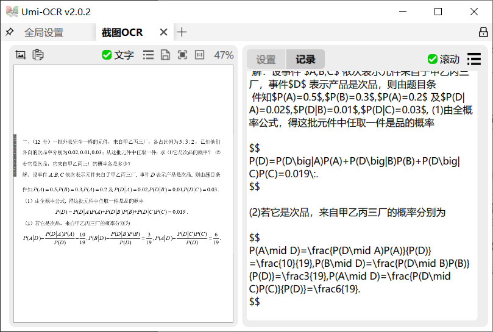

# simpleTex Web API
**此插件仅供学习交流使用**  
plugin version: 0.0.2 适配于Umi-OCR v2.0.2  
使用[SimpleTex主页 致力于提供先进的公式识别/文档识别解决方案](https://simpletex.cn/ai/latex_ocr)的开放api文档提供的api接口，提供一个图片转为Tex文本的OCR方案  

## Dependence
**你需要在umi-ocr自带的python3.8.10环境中的site-packages安装以下包**  
参考[PyStand](https://github.com/skywind3000/PyStand)中关于安装依赖的描述。  
具体来说，使用pyenv或者venv指定版本python3.8.10，使用`pip install 包名`，将pyenv环境下`site-packages`路径下的包移动到`UmiOCR-data\site-packages`中。    
本插件提供截止2024/2/1最新的windows10 64位环境下的包，可使用插件目录下的`site-packages.7z`解压。  
requests  
如果需要使用web api功能可能还需要  
[DrissionPage >= 4.0](https://g1879.gitee.io/drissionpagedocs/) 用于启动无头浏览器，使用selenium替代也可以。  

## 关于proxy设置
请在任何一次ocr开始前将全局设置中的代理相关设置好，否则会出现无法请求网络的现象。或者在你的代理软件中过滤umi-ocr  

## 关于置信度
如果识别类型（recognizing mode）为文档(document)或者自动(auto)时会出现不返回置信度的现象，属response不存在相关键值对的原因。